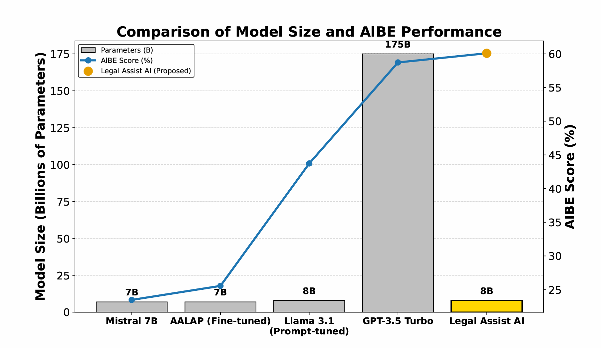

# Legal-Assist-AI ⚖️🤖

Legal-Assist-AI is an AI-powered assistant designed to help users navigate and analyze legal documents, leveraging advanced language models and vector search for efficient information retrieval.

This repository contains the code for a chatbot using `Langchain` and backed by `Meta-Llama-3.1-8B` by `Meta` and `Streamlit` for frontend UI.


## Repository Structure

- `app.py` — Main application entry point.
- `embed.py` — Embedding logic for document processing.
- `langchain_utils.py` — Utilities for integrating with LangChain.
- `data_law/` — Collection of legal PDFs and resources.
- `embed_db/` — Vector database files (FAISS, pickle).
- `requirements.txt` — Python dependencies.
- `Readme.md` — Project documentation.
- `LICENSE` — License information.


## Getting Started
#### 📦 Prerequisites

- Python: **3.13.2** or any compatible version.
- Git (for cloning the repository).
- VS Code Installed

1. Clone the repository:
    ```powershell
    git clone https://github.com/thejatingupta7/Legal-Assist-AI.git
    ```

    ## 🛠️ Setup Instructions

    ### 1. Create and Activate Virtual Environment

    **Windows:**
    ```powershell
    python -m venv myenv
    myenv\Scripts\activate
    ```

    **MacOS/Linux:**
    ```bash
    python3 -m venv myenv
    source myenv/bin/activate
    ```

    ### 2. Install Dependencies

    **GPU Users:**
    ```bash
    pip install torch torchvision torchaudio --index-url https://download.pytorch.org/whl/cu118
    pip install -r requirements.txt
    ```

    **CPU Users:**
    ```bash
    pip install -r requirements.txt
    ```

    ### 3. Install Tesseract for Document Scanning

    **Note:** You need to install Tesseract OCR executable separately:
    - **Windows:** Download from [https://github.com/UB-Mannheim/tesseract/wiki](https://github.com/UB-Mannheim/tesseract/wiki)
    - **Mac:** `brew install tesseract`
    - **Linux:** `sudo apt-get install tesseract-ocr`

    Then configure the path in your code:
    ```python
    # Set the tesseract executable path (update this path based on your installation)
    pytesseract.pytesseract.tesseract_cmd = r'C:\Program Files\Tesseract-OCR\tesseract.exe'  # Windows example
    ```


    ### 4. Install Ollama and Download Model

    1. Download Ollama from [https://ollama.com](https://ollama.com)
    2. Pull the model:
        ```bash
        ollama pull llama3.1:8b
        ```

    ### 5. Run the Application

    ```bash
    # Generate embeddings
    python embed.py

    # Launch the app
    streamlit run app.py
    ```

## FrontEnd (User Interface)


## Framework of Legal Assist AI

<div align="center">
    

</div>

## Results on All India Bar Exam

Performace scoring of 60.08% by the Legal-Assist-AI framework on `All-India Bar Exam` Benchmark, which is 22
times more efficient than GPT-3.5 Turbo.
Tradeoff between Model Size and AIBE Performance scoring is visualized in the chart given below:




## License

This project is licensed under the terms of the LICENSE file.


## 📚 Citation
If you intend to use this work, please cite as:

```bibtex
@misc{gupta2025legalassistaileveraging,
      title={Legal Assist AI: Leveraging Transformer-Based Model for Effective Legal Assistance}, 
      author={Jatin Gupta and Akhil Sharma and Saransh Singhania and Ali Imam Abidi},
      year={2025},
      eprint={2505.22003},
      archivePrefix={arXiv},
      primaryClass={cs.CL},
      doi={10.48550/arXiv.2505.22003},
      url={https://arxiv.org/abs/2505.22003}, 
}


